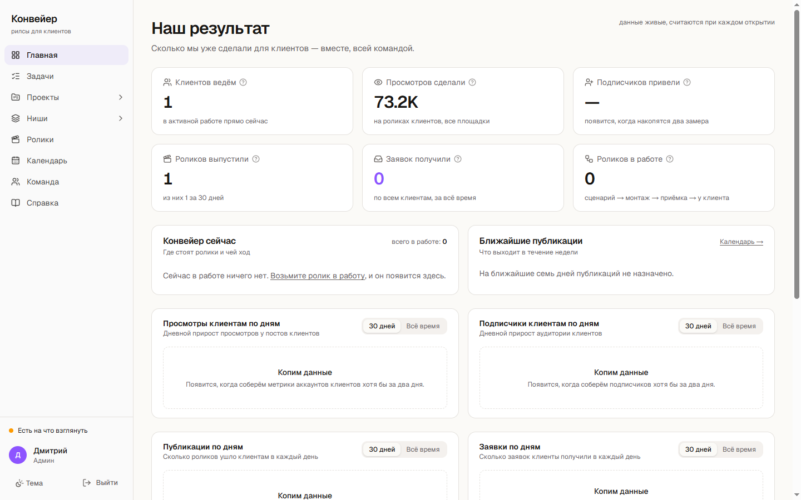

# Что я собрал: два проекта в продакшене

Страница для быстрого просмотра: открывается в браузере, ничего устанавливать не нужно.
Код первого проекта лежит рядом, в этом же репозитории.

---

## 1. Конвейер обработки документов

Ежедневно работает по расписанию на арендованном сервере, без моего участия.
Около 150 модулей на Python.

**Задача, из которой вырос.** Я ИП и участвую в закупках. Каждый день уходило несколько
часов на одно и то же: прочитать комплект документов, вытащить требования, посчитать,
выполнима ли работа за назначенные деньги. Ошибка стоила денег - контракт, который
нельзя сдать за предложенную цену.

**Что делает.** Забирает комплекты из внешнего источника, разбирает PDF, DOCX, XLSX
и DOC своими парсерами, извлекает требования, считает экономику и присылает готовый
вердикт с обоснованием в Telegram.

**Результат.** Обработано 469 комплектов документов, 455 объектов в базе.

### Как выглядит работа: реальный вывод прогона

Запускается одной командой - `python examples/demo.py`:

```
комплект: data/docs/DEMO-001

--- 1. Извлечение текста
   tz.docx        -> текст извлечён

--- 2. Контроль полноты
   НЕ ПРОЧИТАНО: smeta.pdf - PDF без текстового слоя (скан)
   🔴 КРАСНЫЙ: решение принимать нельзя, комплект неполный

--- 3. Журнал решений
   записано решение №2
   всего                      2
   закрытых                   2
   открытых                   0
   по решениям                {'propuskaem': 2}
   средняя ошибка прогноза    0.0
   пар для сверки             2

--- 4. Сторож конвейера
   до прогона: КРАСНЫЙ - последний успешный прогон 53.6 ч назад - конвейер стоит
   после прогона: ЗЕЛЁНЫЙ - прогон 0.0 ч назад, обработано документов: 1
```

Здесь видно главное, что я в эту систему заложил: она **останавливается сама**, когда
данных не хватает. В примере выше смета оказалась сканом без текстового слоя - и система
не стала принимать решение по неполному комплекту, а зажгла красный.

### Почему каждый модуль такой

Все четыре части выросли из конкретных аварий. Архитектурных идей в них нет.

| Модуль | Случай, из-за которого появился |
|---|---|
| Свои парсеры вместо готовой конвертации | Готовая библиотека выдала **712 символов вместо 30 262** - весь текст был набран таблицей. Ошибки не было, файл был, в логах успешная обработка |
| Контроль полноты | Решение принималось по половине комплекта, и это выглядело как нормальная работа |
| Сторож конвейера | Ежедневный сбор **молча стоял пять суток**: расписание отрабатывало, логи писались, данных не было |
| Журнал решений | Нужна была измеримая метрика качества вместо ощущения: прогноз записывается, позже дописывается факт |

Код: [`pipeline/`](pipeline) · запуск: [`examples/demo.py`](examples/demo.py)

---

## 2. «Конвейер» - веб-система ведения клиентов

Внутренний продукт для моего маркетингового направления. От пустой папки до работающего
прода - **два дня**, дальше дорабатывался.

**Стек.** Next.js 16 на Vercel, PostgreSQL через Supabase: 11 таблиц, миграции, функции
очереди заданий, Storage для медиа. Фоновые воркеры на Python с LLM.

**Что внутри.** Личные кабинеты с разграничением по ролям: у администратора одно рабочее
место, у исполнителя другое. Задача проходит пять стадий от постановки до приёмки, с лентой
комментариев. Витрина материалов, календарь публикаций, сводка по результату с графиками
по дням. Уведомления в Telegram.

**Воркеры.** Разбирают очередь заданий: анализ материала по ссылке с извлечением метрик,
генерация альтернативной версии сценария, озвучка в Storage, автоматические описания.



На экране выше - живые данные: они пересчитываются при каждом открытии.
Где данных ещё не хватает, система честно пишет «копим данные» вместо того, чтобы рисовать
пустой график.

Репозиторий приватный, потому что внутри данные клиентов. Покажу на созвоне или дам доступ.

---

## Как я работаю

Код пишет модель, я разбираю задачу, ставлю её, проверяю результат на живых данных,
отлаживаю и довожу до запуска. Основной инструмент - Claude Code, каждый день.
Параллельно держу второго агента на объёмной рутине: пишу задание с критериями приёмки,
забираю результат, прогоняю через отдельного ревизора и возвращаю на доработку.

Главное в этой работе - отличать работающий результат от правдоподобного. Модель уверенно
выдаёт код, который выглядит правильным и разваливается на живых данных. Почти все ошибки
в обеих системах нашлись именно так, и из каждой вырос отдельный модуль.
